# LLM Judge Bench

> **How different are LLMs as text-quality judges?**
> Measure cross-model perplexity agreement with statistical rigour.


---

## Table of Contents

- [Overview](#overview)
- [Core Idea](#core-idea)
- [Quick Start](#quick-start)
- [Repository Structure](#repository-structure)
- [Usage](#usage)
- [Datasets](#datasets)
- [Analysis Metrics](#analysis-metrics)
- [Outputs](#outputs)
- [Results Gallery](#results-gallery)
- [Extending](#extending)

---

## Overview

**LLM Judge Bench** is a framework for evaluating **diversity and redundancy of LLMs as text-quality judges** using cross-model perplexity matrices and pairwise statistical tests.

Given a set of models and a corpus of texts, it asks:
- Do different models assign statistically similar perplexity distributions?
- Which models are redundant judges?
- Where do they disagree most?

---

## Core Idea

Define $N$ models $M_1, \ldots, M_N$ and $K$ texts $x_1, \ldots, x_K$. Compute the **score matrix** $S \in \mathbb{R}^{N \times K}$:

$$S[i,\, j] = \frac{1}{T_j} \sum_{t=1}^{T_j} \log p_{M_i}\!\left(x_{j,t} \mid x_{j,<t}\right)$$

where $T_j$ is the token length of text $x_j$. The corresponding **perplexity** is:

$$\mathrm{PPL}_{M_i}(x_j) = \exp\!\left(-S[i,\, j]\right)$$

Then test: do different models assign statistically similar perplexity distributions?

---

## Quick Start

```bash
pip install -r requirements.txt
python run.py --n-samples 100
```

---

## Repository Structure

```
.
├── configs/          YAML config — which models to load
├── loaders/          Dataset loaders (hendrycks/ethics, yahoo_answers_topics)
├── models/           BaseModel + HuggingFace causal-LM wrapper
├── evaluation/       Cross-model perplexity matrix computation
├── analysis/         Pairwise KS tests, distance correlation, PCA
├── outputs/          Generated artefacts (CSV scores + heatmaps)
├── run.py            Full evaluation pipeline
└── show.py           Per-phrase perplexity viewer
```

---

## Usage

### Full evaluation — `run.py`

Computes the full perplexity matrix, pairwise statistics, and heatmaps for all datasets:

```bash
python run.py --n-samples 100
python run.py --n-samples 50 --output results/ --seed 0 --config configs/models.yaml
```

### Per-phrase viewer — `show.py`

Prints each phrase alongside the perplexity every model assigns to it:

```bash
# ethics subsets (default: commonsense)
python show.py --samples 10
python show.py --samples 5 --subset deontology

# yahoo topics
python show.py --samples 20 --dataset yahoo --topic Health
python show.py --samples 10 --dataset yahoo --topic Sports
```

<details>
<summary>Example output</summary>

```
══════════════════════════════════════════════════════════════════════════
  Dataset : ethics / commonsense
  Phrases : 5
══════════════════════════════════════════════════════════════════════════
  Phrase                                             gemma-4-E2B  Qwen3.5-4B  Llama-3.2-3B
  ────────────────────────────────────────────────────────────────────────
  He helped the old lady cross the street safely.        12.34       15.21         18.90
  She returned the wallet she found on the ground.        9.87       11.02         14.55
  …
  ────────────────────────────────────────────────────────────────────────
                                               (mean)    11.10       13.11         16.72
```

</details>

### Configuring models — `configs/models.yaml`

Each entry can be a bare model ID or a dict with optional parameters:

```yaml
models:
  - id: meta-llama/Llama-3.2-3B
    dtype: float16
    batch_size: 1
    quantization: int4   # int4 | int8 | omit for none
```

Supported keys: `dtype`, `device`, `batch_size`, `max_length`, `num_threads`, `quantization`.

---

## Datasets

| Dataset | Source | Subsets / Topics |
|---|---|---|
| `hendrycks/ethics` | HuggingFace | commonsense · deontology · justice · utilitarianism · virtue |
| `yahoo_answers_topics` | HuggingFace | Society · Science · Health · Education · Computers · Sports · Business · Entertainment · Family · Politics |

---

## Analysis Metrics

For each model pair $(M_i, M_j)$, two agreement metrics are computed over their $K$-dimensional perplexity vectors $\mathbf{s}_i, \mathbf{s}_j \in \mathbb{R}^K$:

### Spearman Rank Correlation

$$r_s(M_i, M_j) = 1 - \frac{6\displaystyle\sum_{k=1}^{K} d_k^2}{K(K^2 - 1)}$$

where $d_k = \mathrm{rank}(s_{i,k}) - \mathrm{rank}(s_{j,k})$ is the rank difference for text $k$.
$r_s = 1$ → identical ranking · $r_s = -1$ → fully reversed · $r_s \approx 0$ → no agreement.

### Distance Correlation

$$\mathrm{dCor}(M_i, M_j) = \sqrt{\frac{\mathrm{dCov}^2(\mathbf{s}_i,\, \mathbf{s}_j)}{\sqrt{\mathrm{dCov}^2(\mathbf{s}_i,\, \mathbf{s}_i)\cdot \mathrm{dCov}^2(\mathbf{s}_j,\, \mathbf{s}_j)}}}$$

Unlike Spearman, $\mathrm{dCor} = 0$ implies full statistical independence (not just linear/monotone independence).

| Metric | Range | Interpretation |
|---|---|---|
| Spearman $r_s$ | $[-1,\ 1]$ | Ranking agreement |
| Spearman $p$-value | $[0,\ 1]$ | Significance of $r_s$ |
| $\mathrm{dCor}$ | $[0,\ 1]$ | General statistical dependence |
| $\mathrm{dCor}$ $p$-value | $[0,\ 1]$ | Significance of $\mathrm{dCor}$ |

---

## Outputs

Results are written to `outputs/<dataset>/<subset>/`:

| File | Description |
|---|---|
| `perplexity.csv` | $K \times N$ perplexity scores (rows = texts, cols = models) |
| `spearman_r.csv` | $N \times N$ Spearman $r_s$ matrix |
| `spearman_pvalue.csv` | $N \times N$ Spearman $p$-value matrix |
| `dcor_stat.csv` | $N \times N$ distance correlation matrix |
| `dcor_pvalue.csv` | $N \times N$ distance correlation $p$-value matrix |
| `heatmap.png` | Spearman $r_s$ + $\mathrm{dCor}$ heatmaps side by side |

---

## Results Gallery

### Ethics

| Subset | Heatmap |
|---|---|
| **Commonsense** | 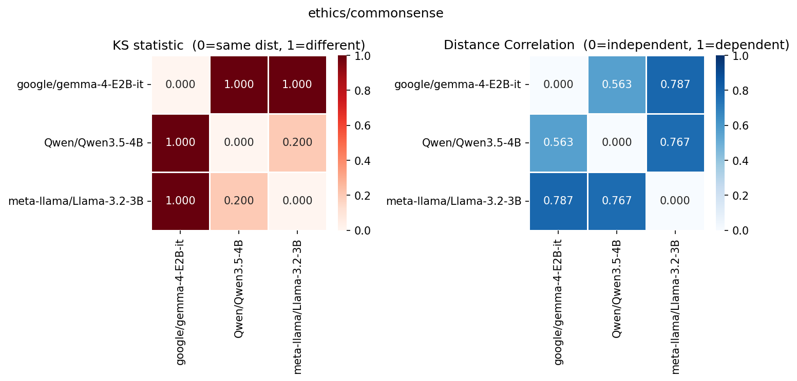 |
| **Deontology** | 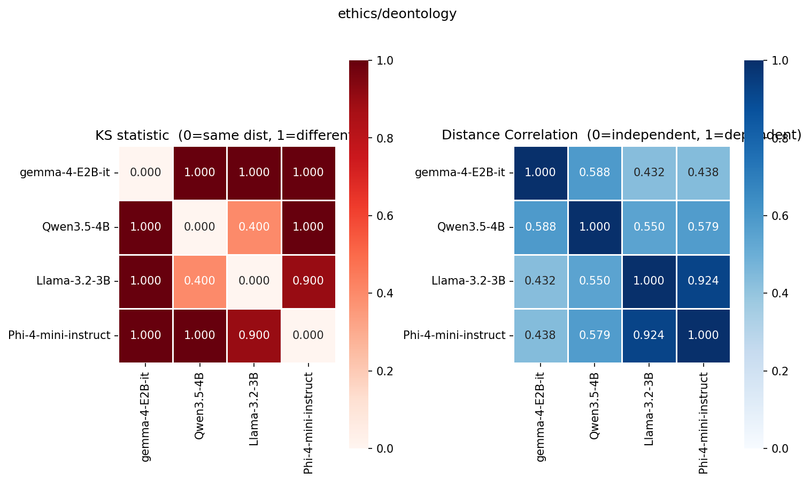 |
| **Justice** | 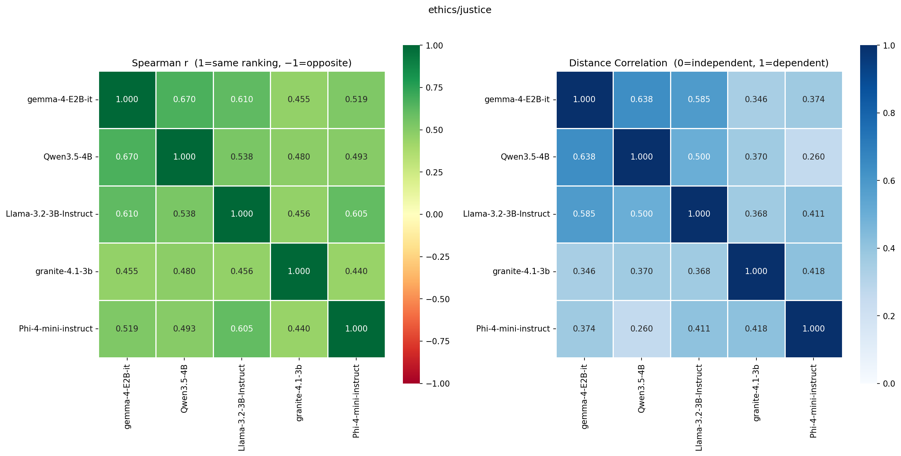 |
| **Utilitarianism** | 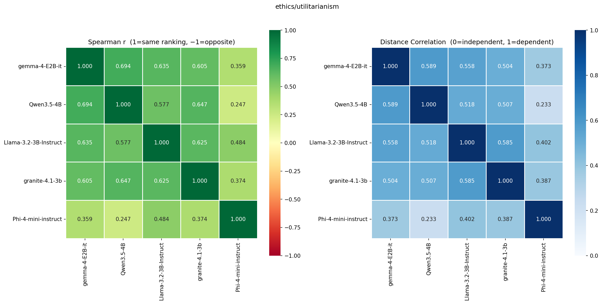 |
| **Virtue** | 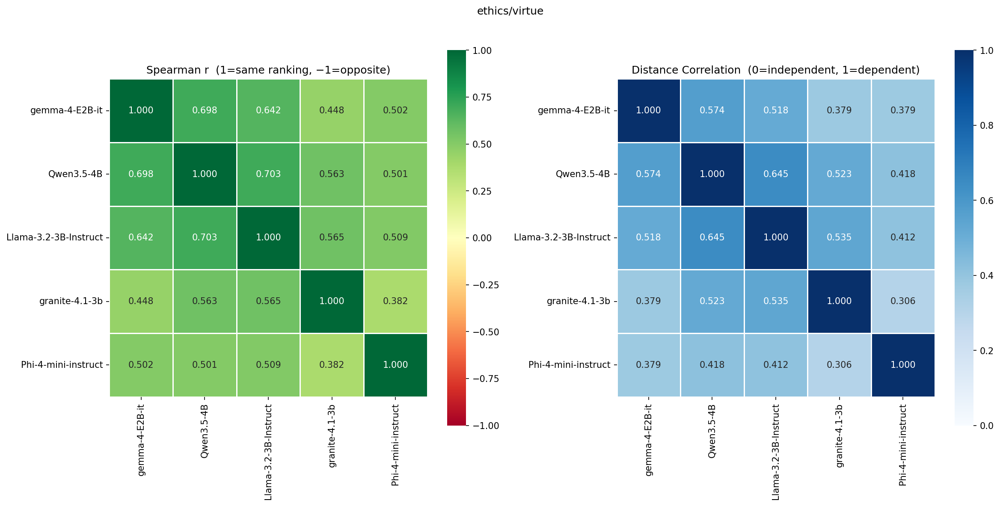 |

### Yahoo Answers Topics

| Topic | Heatmap |
|---|---|
| **Business & Finance** | 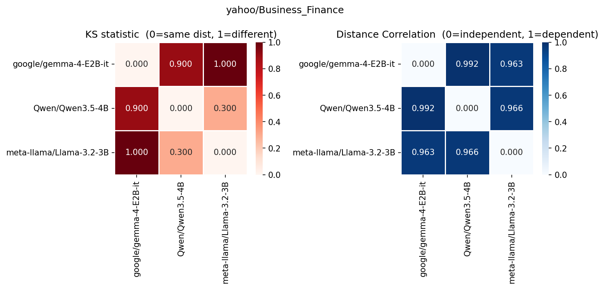 |
| **Computers & Internet** | 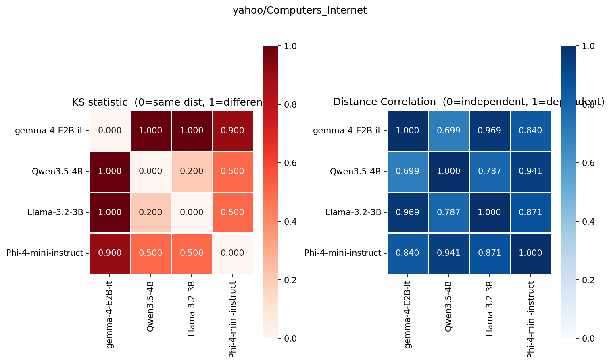 |
| **Education & Reference** | 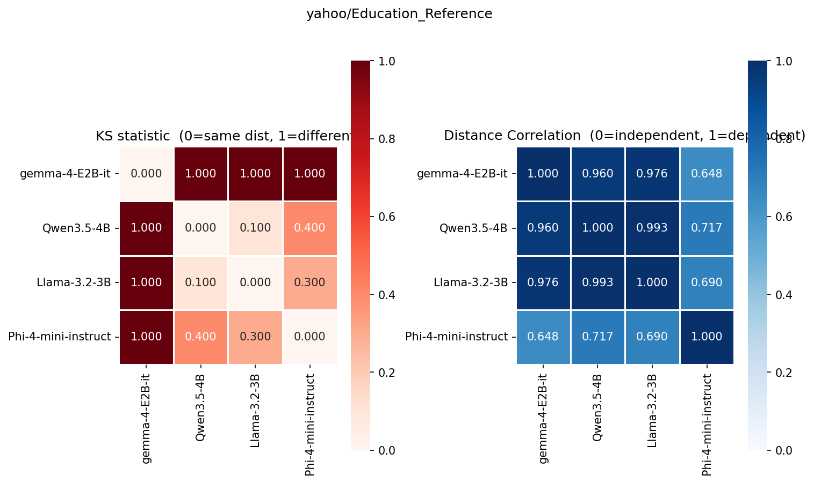 |
| **Entertainment & Music** | 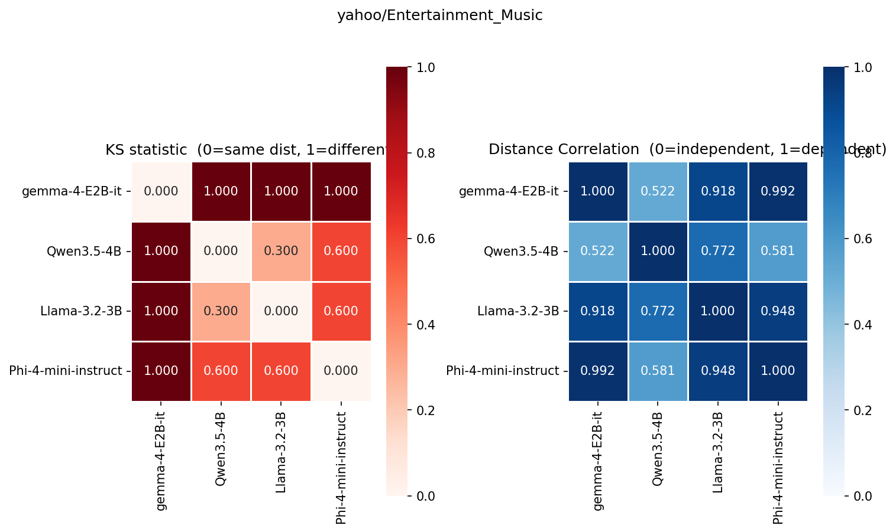 |
| **Family & Relationships** |  |
| **Health** | 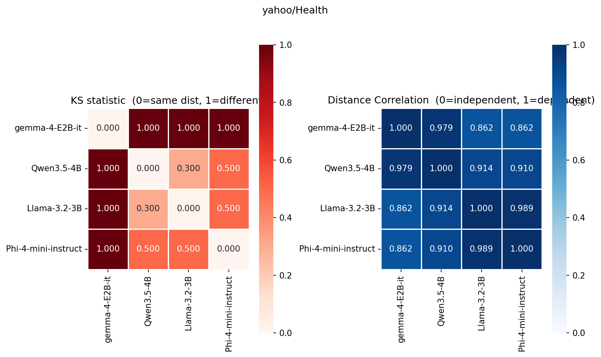 |
| **Politics & Government** | 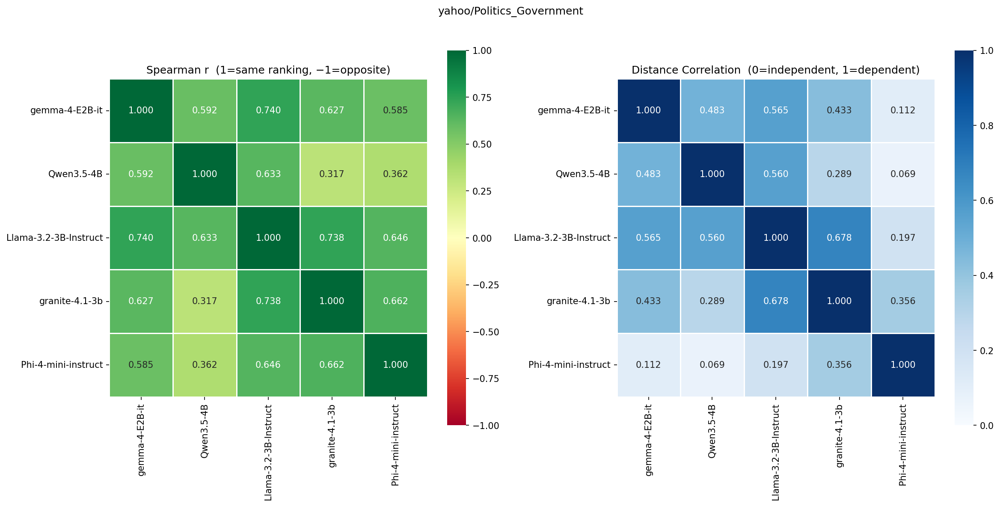 |
| **Science & Mathematics** | 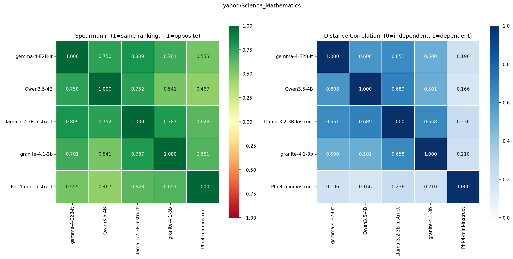 |
| **Society & Culture** | 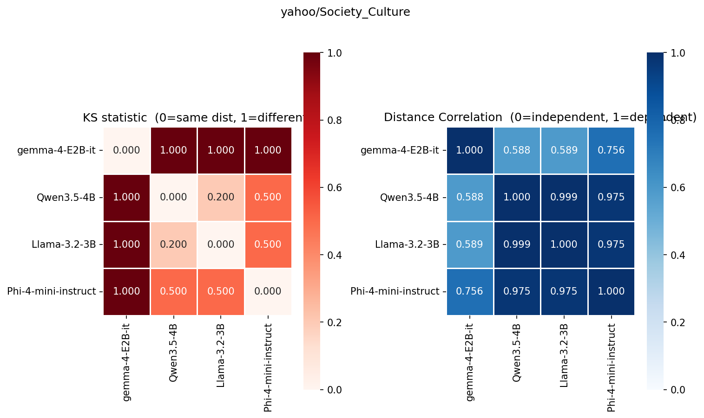 |
| **Sports** | 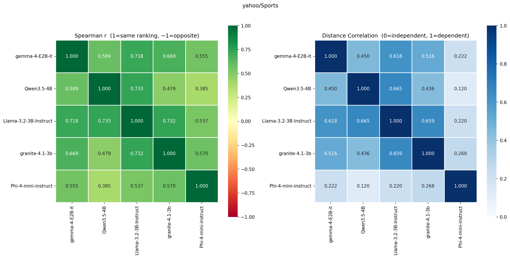 |

---

## Extending

**Add a model backend** — subclass `BaseModel` in [models/base.py](models/base.py), implement `logprobs` and optionally `batch_logprobs`.

**Add a dataset** — add a loader in [loaders/](loaders/) that returns `list[str]`, then call it from `run.py`.

**Add an analysis** — operate on the $(N \times K)$ numpy score matrix $S$ returned by `evaluation.matrix.compute_matrix`.
